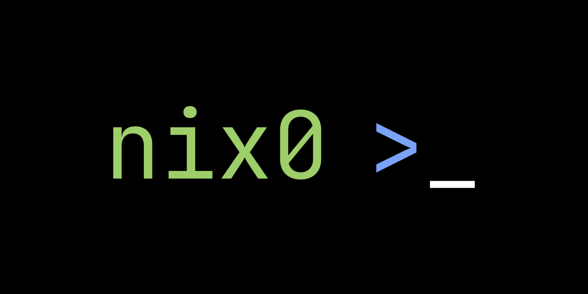
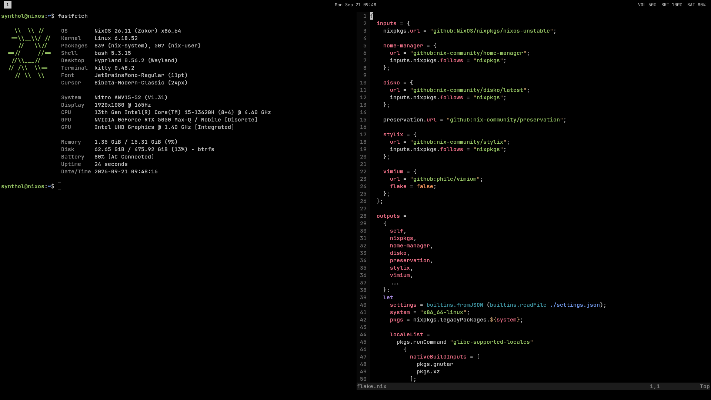
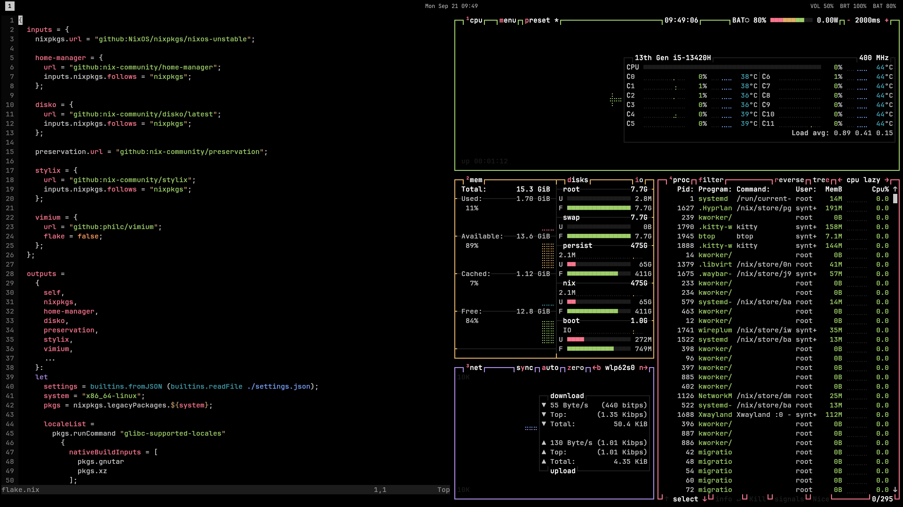
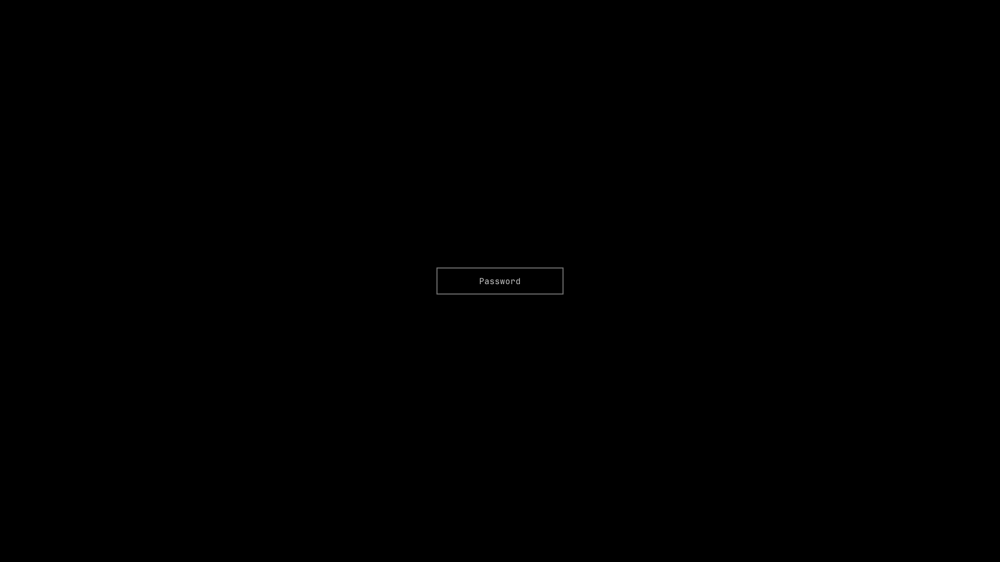

<div align="center">
  <p>
    
  </p>
  <p>A minimal NixOS configuration built around Hyprland.</p>
  <p><strong><a href="docs/">Documentation</a></strong></p>
  <p>
    <a href="https://github.com/synthol/nix0/stargazers">
      
    </a>
    <a href="https://github.com/synthol/nix0/actions/workflows/ci.yml">
      
    </a>
    <a href="https://nixos.org">
      
    </a>
    <a href="LICENSE">
      
    </a>
  </p>
</div>

nix0 provides a minimal system you can use as is or extend. It centres on
keyboard control and terminal workflows, omitting common desktop components
such as an application launcher and file manager. It reduces visual
distractions with a black background and disables borders, blur, gaps, and
animations.

For tools you only need occasionally, consider using `nix run` or `nix shell`
to keep the declared package set small.

## Features

- **Desktop:** Preconfigured Hyprland session with Waybar
- **Theming:** Coordinated styling through Stylix
- **Navigation:** Vim-style controls across Hyprland, Neovim, Vimium, and more
- **Storage:** Disko-managed GPT, LUKS, Btrfs, and an ephemeral root with preserved state
- **Installation:** Guided installer with Gum and NixOS Facter
- **Configuration:** Post-install settings through [`settings.json`](docs/settings.md), including NVIDIA profiles and GPU passthrough
- **Virtualisation:** libvirt/QEMU/KVM with virt-manager and optional VFIO and Looking Glass

## Screenshots

<p align="center">
  <br>
  
  
</p>

## Installation

**Requirements**

- An x86_64 system using UEFI
- Secure Boot disabled
- An internet connection
- A dedicated installation disk of at least 32 GiB

> [!WARNING]
> The installer erases the selected disk after displaying its identity and
> requiring explicit confirmation.

Create and boot installation media using an official
[NixOS ISO](https://nixos.org/download/), then connect to the internet and run:

```sh
sudo nix --extra-experimental-features 'nix-command flakes' run 'github:synthol/nix0/3.0.0#install'
```

When installing from a graphical terminal, match the live desktop's keyboard
layout and variant to the installer prompt before confirming. The standard
variant is used when none is shown. On a Linux virtual console, the installer
applies the selection automatically.

To use a Linux virtual console, press `Ctrl+Alt+F3`.

After installation, select **Power off now**. Once the computer is fully off,
remove the installation media, then power it on. Unlock the disk with your
encryption passphrase and log in; Hyprland starts automatically.
Press `Super+T` to open a terminal.

The installer does not configure NVIDIA automatically; see
[NVIDIA](docs/nvidia.md) for setup.

If needed, connect to a network with:

```sh
nmtui connect
```
